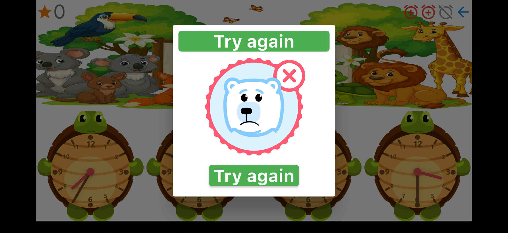
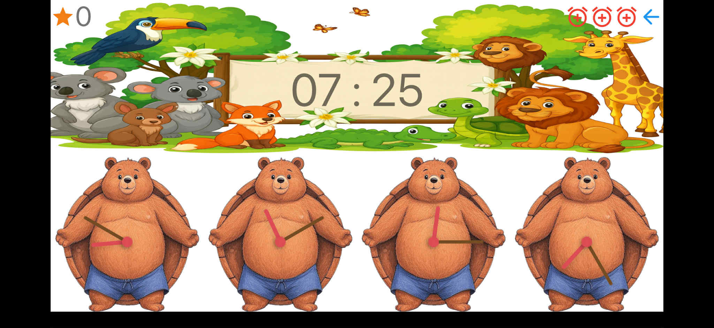

[ ](https://dart.dev/)
[](https://flutter.dev/)

# Clock Game

### Index

* [Introduction](#introduction)
* [Languages](#languages)
* [Usage](#usage)
* [Packages](#packages)
* [Screenshots](#screenshots)
* [Attributions](#attributions)

### Introduction

Clock Game is a children's game created with Flutter.

### Languages

* English
* Bulgarian

### Usage

To clone and run this application, you'll need [git](https://git-scm.com) and [flutter](https://flutter.dev/docs/get-started/install) installed on your computer. From your command line:

```bash
# Clone this repository
$ git clone https://github.com/recepbasturk/clock_game

# Go into the repository
$ cd Kids_clock_game

# Install dependencies
$ flutter packages get

# Run the app
$ flutter run
```

### Packages

The packages used in this Project

Package | Description
---|---
[bloc](https://pub.dev/packages/bloc) + [flutter_bloc](https://pub.dev/packages/flutter_bloc) + [equatable](https://pub.dev/packages/equatable) | Bloc State Management
[intl](https://pub.dev/packages/intl) | Localization
[lottie](https://pub.dev/packages/lottie) | Lottie Animations
[shared_preferences](https://pub.dev/packages/shared_preferences) | Data Persistance

### Screenshots

 

 

 

### Attributions

* dart file :
  * [\lib\game\widgets\analog_clock_build.dart](https://github.com/AkashDivya/infinity_flutter_clock)

* animations :
  * [Cloud and sun](https://lottiefiles.com/50651-cloudy)
  * [Bear success](https://lottiefiles.com/40445-paul-r-bear-success)
  * [Bear fail](https://lottiefiles.com/40444-paul-r-bear-fail)
  * [Heart break](https://lottiefiles.com/3856-heart-break-or-unlike)
